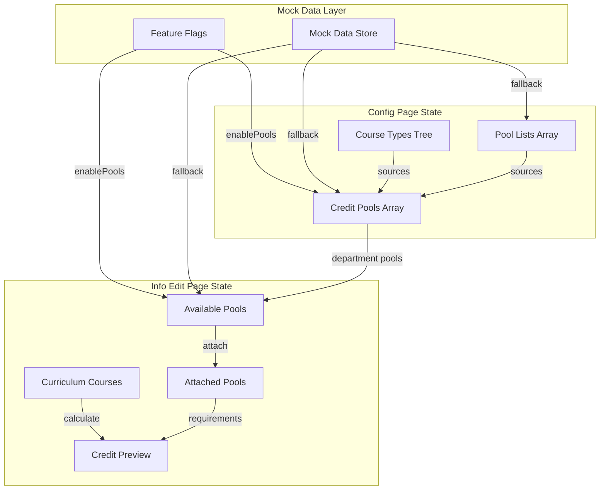

# Design Document: Credit Pool UI Flow

## Overview

This design document outlines the frontend implementation for the Credit Pool and Pool List management features in the Chairperson interface. The implementation focuses on creating a complete user flow with mock data to demonstrate functionality before backend integration. The design follows the existing patterns in the codebase, leveraging the collapsible card layout, modal-based CRUD operations, and the feature flag system already in place.

## Architecture

### High-Level Component Structure

```
┌─────────────────────────────────────────────────────────────────┐
│                     Config Page (info_config)                    │
├─────────────────────────────────────────────────────────────────┤
│  ┌─────────────────────────────────────────────────────────┐   │
│  │              Pools & Lists Section (Collapsible)         │   │
│  │  ┌─────────────────┐  ┌─────────────────────────────┐   │   │
│  │  │  Credit Pools   │  │      Pool Lists             │   │   │
│  │  │  - Pool Cards   │  │  - List Cards               │   │   │
│  │  │  - Add Pool     │  │  - Add List                 │   │   │
│  │  │  - Drag Order   │  │  - CSV Upload               │   │   │
│  │  └─────────────────┘  └─────────────────────────────┘   │   │
│  └─────────────────────────────────────────────────────────┘   │
└─────────────────────────────────────────────────────────────────┘

┌─────────────────────────────────────────────────────────────────┐
│                  Info Edit Page (info_edit/[id])                 │
├─────────────────────────────────────────────────────────────────┤
│  ┌─────────────────────────────────────────────────────────┐   │
│  │                 Pools & Lists Tab                        │   │
│  │  ┌─────────────────────────────────────────────────┐    │   │
│  │  │  Available Pools (from department)              │    │   │
│  │  │  - Attach to curriculum                         │    │   │
│  │  └─────────────────────────────────────────────────┘    │   │
│  │  ┌─────────────────────────────────────────────────┐    │   │
│  │  │  Attached Pools (curriculum-specific)           │    │   │
│  │  │  - Credit requirements                          │    │   │
│  │  │  - Credit preview                               │    │   │
│  │  │  - Drag order                                   │    │   │
│  │  └─────────────────────────────────────────────────┘    │   │
│  └─────────────────────────────────────────────────────────┘   │
└─────────────────────────────────────────────────────────────────┘
```

### State Management Flow



## Components and Interfaces

### New Components

#### 1. CreditPoolCard Component
Location: `src/components/features/curriculum/CreditPoolCard.tsx`

```typescript
interface CreditPoolCardProps {
  pool: CreditPool;
  onEdit: (pool: CreditPool) => void;
  onDelete: (poolId: string) => void;
  onDragStart?: (e: React.DragEvent, poolId: string) => void;
  onDragOver?: (e: React.DragEvent) => void;
  onDrop?: (e: React.DragEvent, targetPoolId: string) => void;
  isDragging?: boolean;
  showDragHandle?: boolean;
}
```

#### 2. PoolListCard Component
Location: `src/components/features/curriculum/PoolListCard.tsx`

```typescript
interface PoolListCardProps {
  poolList: PoolList;
  onEdit: (list: PoolList) => void;
  onDelete: (listId: string) => void;
  onViewCourses: (list: PoolList) => void;
}
```

#### 3. AddPoolModal Component
Location: `src/components/features/curriculum/AddPoolModal.tsx`

```typescript
interface AddPoolModalProps {
  isOpen: boolean;
  onClose: () => void;
  onSave: (pool: NewCreditPool) => void;
  courseTypes: CourseTypeTreeNode[];
  poolLists: PoolList[];
  editingPool?: CreditPool | null;
}
```

#### 4. AddPoolListModal Component
Location: `src/components/features/curriculum/AddPoolListModal.tsx`

```typescript
interface AddPoolListModalProps {
  isOpen: boolean;
  onClose: () => void;
  onSave: (list: NewPoolList) => void;
  editingList?: PoolList | null;
}
```

#### 5. PoolSourceSelector Component
Location: `src/components/features/curriculum/PoolSourceSelector.tsx`

```typescript
interface PoolSourceSelectorProps {
  courseTypes: CourseTypeTreeNode[];
  poolLists: PoolList[];
  selectedSources: PoolSource[];
  onSourcesChange: (sources: PoolSource[]) => void;
}
```

#### 6. CurriculumPoolAttachment Component
Location: `src/components/features/curriculum/CurriculumPoolAttachment.tsx`

```typescript
interface CurriculumPoolAttachmentProps {
  pool: CreditPool;
  attachment: CurriculumPoolAttachment;
  appliedCredits: number;
  overflowCredits: number;
  onUpdate: (attachment: CurriculumPoolAttachment) => void;
  onDetach: (attachmentId: string) => void;
  onDragStart?: (e: React.DragEvent, attachmentId: string) => void;
  onDragOver?: (e: React.DragEvent) => void;
  onDrop?: (e: React.DragEvent, targetAttachmentId: string) => void;
}
```

#### 7. PoolCreditPreview Component
Location: `src/components/features/curriculum/PoolCreditPreview.tsx`

```typescript
interface PoolCreditPreviewProps {
  attachments: CurriculumPoolAttachmentWithCredits[];
  totalCurriculumCredits: number;
  freeElectiveOverflow: number;
}
```

### Enhanced PoolsListsTab Component

The existing `PoolsListsTab.tsx` will be significantly enhanced to support the full pool management workflow:

```typescript
interface EnhancedPoolsListsTabProps {
  curriculumId: string;
  curriculumName?: string;
  departmentId?: string;
  courseTypes: CourseTypeLite[];
  courses: CurriculumCourseLite[];
  isLoadingCourseTypes?: boolean;
  // New props
  availablePools: CreditPool[];
  attachedPools: CurriculumPoolAttachment[];
  poolLists: PoolList[];
  onAttachPool: (poolId: string, credits: PoolCreditConfig) => void;
  onDetachPool: (attachmentId: string) => void;
  onUpdateAttachment: (attachment: CurriculumPoolAttachment) => void;
  onReorderAttachments: (orderedIds: string[]) => void;
  isDemoMode?: boolean;
}
```

## Data Models

### Core Types

```typescript
// Credit Pool Definition (department-level)
interface CreditPool {
  id: string;
  name: string;
  description?: string;
  departmentId: string;
  minCredits: number;
  maxCredits: number | null;
  allowNonCurriculum: boolean;
  sources: PoolSource[];
  orderIndex: number;
  createdAt: string;
  updatedAt: string;
}

// Pool Source (course type or pool list reference)
interface PoolSource {
  id: string;
  poolId: string;
  sourceType: 'COURSE_TYPE' | 'COURSE_LIST';
  courseTypeId?: string | null;
  courseListId?: string | null;
  // Resolved data for display
  sourceName?: string;
  sourceColor?: string;
}

// Pool List (reusable course collection)
interface PoolList {
  id: string;
  name: string;
  description?: string;
  departmentId: string;
  listType: 'POOL_LIST';
  defaultRequiredCredits?: number;
  courses: PoolListCourse[];
  createdAt: string;
  updatedAt: string;
}

interface PoolListCourse {
  id: string;
  courseListId: string;
  courseId: string;
  // Resolved course data
  code: string;
  name: string;
  credits: number;
}

// Curriculum Pool Attachment
interface CurriculumPoolAttachment {
  id: string;
  curriculumId: string;
  creditPoolId: string;
  requiredCredits: number;
  maxCredits: number | null;
  orderIndex: number;
  createdAt: string;
  updatedAt: string;
  // Resolved pool data
  pool?: CreditPool;
}

// Credit calculation result
interface PoolCreditCalculation {
  poolId: string;
  poolName: string;
  requiredCredits: number;
  maxCredits: number | null;
  appliedCredits: number;
  remainingCredits: number;
  overflowCredits: number;
  isSatisfied: boolean;
  matchedCourses: string[]; // course IDs
}

// New pool form data
interface NewCreditPool {
  name: string;
  description?: string;
  minCredits: number;
  maxCredits: number | null;
  allowNonCurriculum: boolean;
  sources: Omit<PoolSource, 'id' | 'poolId'>[];
}

// New pool list form data
interface NewPoolList {
  name: string;
  description?: string;
  defaultRequiredCredits?: number;
  courseCodes: string[];
}

// Pool credit configuration for attachment
interface PoolCreditConfig {
  requiredCredits: number;
  maxCredits: number | null;
}
```

### Mock Data Structure

```typescript
// Mock data store for demo mode
interface MockDataStore {
  creditPools: CreditPool[];
  poolLists: PoolList[];
  curriculumPoolAttachments: Map<string, CurriculumPoolAttachment[]>;
}

// Initial mock data
const MOCK_CREDIT_POOLS: CreditPool[] = [
  {
    id: 'pool-1',
    name: 'Core Engineering',
    description: 'Fundamental engineering courses required for all students',
    departmentId: 'dept-1',
    minCredits: 30,
    maxCredits: null,
    allowNonCurriculum: false,
    sources: [
      { id: 'src-1', poolId: 'pool-1', sourceType: 'COURSE_TYPE', courseTypeId: 'type-core' }
    ],
    orderIndex: 0,
    createdAt: '2025-01-01T00:00:00Z',
    updatedAt: '2025-01-01T00:00:00Z'
  },
  {
    id: 'pool-2',
    name: 'Major Electives',
    description: 'Elective courses within the major field',
    departmentId: 'dept-1',
    minCredits: 15,
    maxCredits: 24,
    allowNonCurriculum: false,
    sources: [
      { id: 'src-2', poolId: 'pool-2', sourceType: 'COURSE_TYPE', courseTypeId: 'type-major-elective' }
    ],
    orderIndex: 1,
    createdAt: '2025-01-01T00:00:00Z',
    updatedAt: '2025-01-01T00:00:00Z'
  },
  {
    id: 'pool-3',
    name: 'General Education',
    description: 'Broad educational foundation courses',
    departmentId: 'dept-1',
    minCredits: 30,
    maxCredits: 36,
    allowNonCurriculum: false,
    sources: [
      { id: 'src-3', poolId: 'pool-3', sourceType: 'COURSE_TYPE', courseTypeId: 'type-ge' }
    ],
    orderIndex: 2,
    createdAt: '2025-01-01T00:00:00Z',
    updatedAt: '2025-01-01T00:00:00Z'
  },
  {
    id: 'pool-4',
    name: 'Free Electives',
    description: 'Any courses to fulfill remaining credit requirements',
    departmentId: 'dept-1',
    minCredits: 6,
    maxCredits: null,
    allowNonCurriculum: true,
    sources: [],
    orderIndex: 3,
    createdAt: '2025-01-01T00:00:00Z',
    updatedAt: '2025-01-01T00:00:00Z'
  }
];

const MOCK_POOL_LISTS: PoolList[] = [
  {
    id: 'list-1',
    name: 'Data Science Track',
    description: 'Courses for data science specialization',
    departmentId: 'dept-1',
    listType: 'POOL_LIST',
    defaultRequiredCredits: 12,
    courses: [
      { id: 'lc-1', courseListId: 'list-1', courseId: 'c-1', code: 'CS 301', name: 'Machine Learning', credits: 3 },
      { id: 'lc-2', courseListId: 'list-1', courseId: 'c-2', code: 'CS 302', name: 'Data Mining', credits: 3 },
      { id: 'lc-3', courseListId: 'list-1', courseId: 'c-3', code: 'STAT 301', name: 'Statistical Learning', credits: 3 }
    ],
    createdAt: '2025-01-01T00:00:00Z',
    updatedAt: '2025-01-01T00:00:00Z'
  },
  {
    id: 'list-2',
    name: 'Software Engineering Track',
    description: 'Courses for software engineering specialization',
    departmentId: 'dept-1',
    listType: 'POOL_LIST',
    defaultRequiredCredits: 12,
    courses: [
      { id: 'lc-4', courseListId: 'list-2', courseId: 'c-4', code: 'CS 401', name: 'Software Architecture', credits: 3 },
      { id: 'lc-5', courseListId: 'list-2', courseId: 'c-5', code: 'CS 402', name: 'DevOps Practices', credits: 3 }
    ],
    createdAt: '2025-01-01T00:00:00Z',
    updatedAt: '2025-01-01T00:00:00Z'
  }
];
```

## Credit Calculation Logic

### Pool Credit Calculation Algorithm

```typescript
/**
 * Calculates credit distribution across pools for a curriculum
 * 
 * Algorithm:
 * 1. Sort pools by orderIndex (evaluation priority)
 * 2. For each pool in order:
 *    a. Find courses matching pool sources (course types or lists)
 *    b. Exclude courses already consumed by higher-priority pools
 *    c. Apply credits up to maxCredits (if set)
 *    d. Track overflow for Free Elective routing
 * 3. Return per-pool breakdown with satisfaction status
 */
function calculatePoolCredits(
  attachments: CurriculumPoolAttachment[],
  courses: CurriculumCourseLite[],
  courseTypes: CourseTypeLite[],
  poolLists: PoolList[]
): PoolCreditCalculation[] {
  const sortedAttachments = [...attachments].sort((a, b) => a.orderIndex - b.orderIndex);
  const consumedCourseIds = new Set<string>();
  const results: PoolCreditCalculation[] = [];
  
  for (const attachment of sortedAttachments) {
    const pool = attachment.pool;
    if (!pool) continue;
    
    // Find matching courses not yet consumed
    const matchingCourses = courses.filter(course => {
      if (consumedCourseIds.has(course.id)) return false;
      return courseMatchesPoolSources(course, pool.sources, courseTypes, poolLists);
    });
    
    // Calculate applied credits
    let appliedCredits = 0;
    const matchedCourseIds: string[] = [];
    
    for (const course of matchingCourses) {
      const courseCredits = course.credits;
      const wouldExceedMax = attachment.maxCredits !== null && 
        (appliedCredits + courseCredits) > attachment.maxCredits;
      
      if (!wouldExceedMax) {
        appliedCredits += courseCredits;
        matchedCourseIds.push(course.id);
        consumedCourseIds.add(course.id);
      }
    }
    
    // Calculate overflow (credits beyond max that go to Free Elective)
    const potentialCredits = matchingCourses.reduce((sum, c) => sum + c.credits, 0);
    const overflowCredits = attachment.maxCredits !== null 
      ? Math.max(0, potentialCredits - attachment.maxCredits)
      : 0;
    
    results.push({
      poolId: pool.id,
      poolName: pool.name,
      requiredCredits: attachment.requiredCredits,
      maxCredits: attachment.maxCredits,
      appliedCredits,
      remainingCredits: Math.max(0, attachment.requiredCredits - appliedCredits),
      overflowCredits,
      isSatisfied: appliedCredits >= attachment.requiredCredits,
      matchedCourses: matchedCourseIds
    });
  }
  
  return results;
}

/**
 * Checks if a course matches any of the pool's sources
 */
function courseMatchesPoolSources(
  course: CurriculumCourseLite,
  sources: PoolSource[],
  courseTypes: CourseTypeLite[],
  poolLists: PoolList[]
): boolean {
  for (const source of sources) {
    if (source.sourceType === 'COURSE_TYPE' && source.courseTypeId) {
      // Check if course type matches (including parent hierarchy)
      if (courseTypeMatchesHierarchy(course.courseType?.id, source.courseTypeId, courseTypes)) {
        return true;
      }
    } else if (source.sourceType === 'COURSE_LIST' && source.courseListId) {
      // Check if course is in the pool list
      const list = poolLists.find(l => l.id === source.courseListId);
      if (list?.courses.some(lc => lc.courseId === course.id)) {
        return true;
      }
    }
  }
  return false;
}

/**
 * Checks if a course type matches a target type or any of its ancestors
 */
function courseTypeMatchesHierarchy(
  courseTypeId: string | undefined,
  targetTypeId: string,
  courseTypes: CourseTypeLite[]
): boolean {
  if (!courseTypeId) return false;
  if (courseTypeId === targetTypeId) return true;
  
  // Build parent lookup
  const typeMap = new Map(courseTypes.map(t => [t.id, t]));
  
  // Walk up the hierarchy
  let currentType = typeMap.get(courseTypeId);
  while (currentType) {
    const parentId = currentType.parentId ?? currentType.parent_id ?? currentType.parentCourseTypeId;
    if (parentId === targetTypeId) return true;
    currentType = parentId ? typeMap.get(parentId) : undefined;
  }
  
  return false;
}
```

## Error Handling

### Validation Errors

| Error Condition | User Message | Recovery Action |
|----------------|--------------|-----------------|
| Empty pool name | "Pool name is required" | Focus name input field |
| Negative credits | "Credits must be a positive number" | Reset to minimum valid value |
| Max < Min credits | "Maximum credits cannot be less than minimum" | Clear max or adjust min |
| No sources selected | "Select at least one source for the pool" | Highlight source selector |
| Duplicate pool name | "A pool with this name already exists" | Suggest alternative name |
| Invalid CSV format | "Unable to parse file. Please check the format." | Show format guide link |

### State Recovery

- All CRUD operations use optimistic updates with rollback on failure
- Local state changes are persisted to sessionStorage for recovery on page refresh (demo mode only)
- Toast notifications provide undo action for destructive operations (5-second window)

## Testing Strategy

### Unit Tests
- Component rendering tests for all new components
- Credit calculation algorithm tests with various pool configurations
- Validation function tests for form inputs
- Mock data generation and state management tests

### Property-Based Tests
- Pool credit calculation produces consistent results regardless of course order
- Attached pools maintain valid order indices after reordering
- Credit totals never exceed curriculum total credits

### Integration Tests
- Full user flow: create pool → attach to curriculum → view preview
- Drag-and-drop reordering updates state correctly
- Feature flag toggling shows/hides appropriate UI elements


## Correctness Properties

*A property is a characteristic or behavior that should hold true across all valid executions of a system—essentially, a formal statement about what the system should do. Properties serve as the bridge between human-readable specifications and machine-verifiable correctness guarantees.*

Based on the acceptance criteria analysis, the following correctness properties have been identified for property-based testing:

### Property 1: Pool Source Multi-Selection Completeness

*For any* combination of course type nodes and pool lists selected as sources, the pool source selector SHALL accept and store all selected items without loss or duplication.

**Validates: Requirements 1.2**

### Property 2: Pool Save Validation and Display

*For any* valid pool data (non-empty name, non-negative credits, valid sources), saving the pool SHALL add it to the pools list with a card displaying the exact name, credit range (min-max), and correct source count. *For any* pool data with empty or whitespace-only name, saving SHALL be rejected with a validation error.

**Validates: Requirements 1.3, 1.5**

### Property 3: CSV Parsing Produces Valid Course List

*For any* valid CSV content with course code, name, and credits columns, parsing SHALL produce a course list where each entry contains the exact values from the corresponding CSV row.

**Validates: Requirements 2.2**

### Property 4: Course Search Returns Matching Results

*For any* search query string and backing course data, all returned results SHALL contain the search query (case-insensitive) in either the course code or title, and each result SHALL display code, title, and credits.

**Validates: Requirements 2.3**

### Property 5: Pool List Save Displays Correct Count

*For any* pool list with N courses, after saving, the displayed course count badge SHALL show exactly N.

**Validates: Requirements 2.4**

### Property 6: Pool List Edit Updates State

*For any* pool list edit operation (add course, remove course, rename), the saved state SHALL reflect exactly the changes made, with no unintended side effects on other list properties.

**Validates: Requirements 2.5**

### Property 7: Available Pools Display Credit Ranges

*For any* set of department pools, the Pools & Lists tab SHALL display all pools with their minCredits and maxCredits values matching the pool definitions.

**Validates: Requirements 3.1**

### Property 8: Attached Pools Display Calculated Credits

*For any* curriculum with attached pools and courses, each attached pool SHALL display: (a) the curriculum-specific required credits, (b) the calculated applied credits based on matching courses, and (c) the remaining credits needed.

**Validates: Requirements 3.3**

### Property 9: Pool Reordering Maintains Consistency

*For any* reorder operation moving pool from position A to position B, all pools SHALL have consecutive orderIndex values (0, 1, 2, ...) after the operation, and the moved pool SHALL be at position B.

**Validates: Requirements 3.4, 7.2**

### Property 10: Credit Calculation Correctness

*For any* set of curriculum courses and attached pools with sources:
1. Each course SHALL contribute credits to at most one pool (no double counting)
2. Pools SHALL be evaluated in orderIndex sequence
3. Applied credits SHALL not exceed maxCredits when maxCredits is set
4. Overflow credits (beyond maxCredits) SHALL be correctly calculated
5. A pool is marked satisfied if and only if appliedCredits >= requiredCredits

**Validates: Requirements 4.2, 4.3, 4.4**

### Property 11: Real-Time Calculation Updates

*For any* change to pool attachments (add, remove, update credits, reorder), the credit preview calculations SHALL update to reflect the new state within the same render cycle.

**Validates: Requirements 4.5**

### Property 12: Demo Mode CRUD Operations

*For any* CRUD operation (create, read, update, delete) on pools or pool lists in demo mode, the local state SHALL be updated to reflect the operation, and subsequent reads SHALL return the updated data.

**Validates: Requirements 5.3**

### Property 13: Parent Selection Indicates Child Inclusion

*For any* course type hierarchy where a parent node is selected as a pool source, all descendant nodes SHALL be visually indicated as implicitly included.

**Validates: Requirements 6.2**

### Property 14: Course Type Node Display

*For any* course type node in the hierarchy, the display SHALL include the node's color badge and usage count (number of courses using that type).

**Validates: Requirements 6.3**

### Property 15: Breadcrumb Path Correctness

*For any* selected course type node with ancestors, the breadcrumb path SHALL show all ancestor names from root to the selected node, separated by "›", in correct hierarchical order.

**Validates: Requirements 6.5**

### Property 16: Pools Display in Order with Positions

*For any* set of attached pools, they SHALL be displayed in orderIndex sequence, and each pool SHALL show its 1-based position number.

**Validates: Requirements 7.1**

### Property 17: Overlap Detection and Warning

*For any* two pools with overlapping sources (same course type or same pool list), a warning indicator SHALL be displayed on both pools.

**Validates: Requirements 7.3**

### Property 18: Default Alphabetical Ordering

*For any* set of pools without explicit orderIndex values, they SHALL be displayed in alphabetical order by pool name.

**Validates: Requirements 7.5**
