# Course Audit System - Mermaid Architecture Diagram

## Mermaid.live Code

```mermaid
graph TB
    %% Client Layer
    subgraph CLIENT["🔵 CLIENT LAYER"]
        subgraph UI["User Interface"]
            NEXTJS["Next.js 15.1.6<br/>React 19.0.0<br/>TypeScript"]
            TAILWIND["Tailwind CSS<br/>Radix UI<br/>Framer Motion"]
            ROUTING["App Router<br/>Dynamic Routes<br/>Role-based Navigation"]
        end
        
        subgraph FILES["File Management"]
            UPLOAD["Excel/CSV Upload<br/>react-dropzone<br/>Drag & Drop"]
            PROCESS["File Processing<br/>xlsx + papaparse<br/>Validation"]
            EXPORT["PDF/Excel Export<br/>jspdf + file-saver<br/>Progress Reports"]
        end
        
        subgraph SESSION["Session Management"]
            AUTH["NextAuth.js v5<br/>Role-based Auth<br/>Session Persistence"]
            CACHE["SWR Caching<br/>Real-time Updates<br/>Auto-save"]
        end
    end

    %% User Access Points
    subgraph USERS["👥 USER ACCESS TYPES"]
        ANON["🌐 Anonymous Students<br/>Public Course Browsing<br/>No Authentication<br/>Temporary Sessions"]
        STUDENT["👨‍🎓 Authenticated Students<br/>Personal Progress Tracking<br/>Excel Import/Export<br/>🆕 Limited DB Access"]
        CHAIR["👨‍💼 Chairpersons<br/>Faculty-scoped Management<br/>Curriculum Creation<br/>Cross-department Access"]
        ADMIN["🔧 Administrators<br/>System-wide Control<br/>User Management<br/>Global Configuration"]
    end

    %% Server Layer
    subgraph SERVER["🟢 SERVER LAYER"]
        subgraph AUTHZ["Authentication & Authorization"]
            MIDDLEWARE["Route Protection<br/>Role Validation<br/>Department Scoping"]
            RBAC["Role-based Access<br/>Faculty Boundaries<br/>Data Isolation"]
        end
        
        subgraph BUSINESS["Business Logic"]
            COURSE["Course Validation<br/>Academic Rules Engine<br/>Progress Calculation<br/>Graduation Planning"]
            CURRICULUM["Curriculum Processing<br/>Bulk Import System<br/>Two-step Workflow<br/>Faculty Collaboration"]
            REPORTING["Export & Reporting<br/>PDF Generation<br/>Excel Export<br/>Semester Planning"]
        end
        
        subgraph APIS["API Architecture (96+ endpoints)"]
            AUTH_API["/api/auth/*<br/>Authentication"]
            CURRICULA_API["/api/curricula/*<br/>Curriculum Management"]
            COURSES_API["/api/courses/*<br/>Course Operations"]
            STUDENT_API["/api/student-profile/*<br/>🆕 Student DB Access"]
            ADMIN_API["/api/admin/*<br/>Administrative Functions"]
            PUBLIC_API["/api/public-curricula/*<br/>Anonymous Access"]
        end
    end

    %% Data Layer
    subgraph DATA["🟡 DATA LAYER"]
        subgraph DATABASE["PostgreSQL Database"]
            PRISMA["Prisma ORM 6.8.2<br/>Type-safe Queries<br/>Connection Pooling<br/>Migration System"]
        end
        
        subgraph MODELS["Core Data Models (19 entities)"]
            USER_MODEL["👤 Users<br/>4 Roles: Admin, Chair,<br/>Student, Anonymous"]
            ORG_MODELS["🏢 Organization<br/>Faculty → Department<br/>Hierarchy"]
            ACADEMIC["📚 Academic Data<br/>Curriculum → Course<br/>StudentCourse Progress<br/>🆕 Enhanced Student Access"]
            RULES["⚖️ Academic Rules<br/>Concentrations<br/>Blacklists<br/>ElectiveRules"]
        end
        
        subgraph TEMP["Temporary Data"]
            SESSION_DATA["Session Storage<br/>Anonymous Progress<br/>Upload Processing<br/>Browser Persistence"]
        end
    end

    %% Data Flow Connections
    ANON -.->|Browse Only| PUBLIC_API
    STUDENT -->|Progress Tracking<br/>🆕 DB Queries| STUDENT_API
    STUDENT -->|File Upload/Export| FILES
    CHAIR -->|Faculty Management| CURRICULA_API
    CHAIR -->|Course Management| COURSES_API
    ADMIN -->|System Control| ADMIN_API
    
    %% Client to Server
    UI --> MIDDLEWARE
    FILES --> BUSINESS
    SESSION --> AUTHZ
    
    %% Server to Data
    AUTH_API --> USER_MODEL
    CURRICULA_API --> ACADEMIC
    COURSES_API --> ACADEMIC
    STUDENT_API -.->|🆕 Limited Access| ACADEMIC
    ADMIN_API --> ORG_MODELS
    PUBLIC_API -.->|Read Only| ACADEMIC
    
    %% Internal Server Flow
    MIDDLEWARE --> RBAC
    RBAC --> APIS
    BUSINESS --> MODELS
    
    %% Session Flow
    ANON -.->|Temporary| SESSION_DATA
    AUTH --> USER_MODEL
    CACHE --> MODELS

    %% Security Boundaries
    subgraph SECURITY["🔒 SECURITY & ACCESS CONTROL"]
        FACULTY_ISOLATION["Faculty Isolation<br/>Complete Separation"]
        DEPT_SCOPING["Department Scoping<br/>Default + Override"]
        AUDIT_LOG["Audit Logging<br/>Change Tracking"]
    end
    
    RBAC --> SECURITY
    MODELS --> AUDIT_LOG

    %% Technology Stack
    subgraph TECH["⚙️ TECHNOLOGY INTEGRATION"]
        FRONTEND["Frontend Stack<br/>Next.js + React 19<br/>TypeScript + Tailwind"]
        BACKEND["Backend Stack<br/>Prisma + PostgreSQL<br/>NextAuth.js"]
        PROCESSING["File Processing<br/>xlsx + papaparse<br/>jspdf + file-saver"]
    end

    %% Styling
    classDef clientLayer fill:#e1f5fe,stroke:#01579b,stroke-width:2px
    classDef serverLayer fill:#e8f5e8,stroke:#2e7d32,stroke-width:2px  
    classDef dataLayer fill:#fff8e1,stroke:#f57f17,stroke-width:2px
    classDef userAccess fill:#fce4ec,stroke:#c2185b,stroke-width:2px
    classDef security fill:#f3e5f5,stroke:#7b1fa2,stroke-width:2px
    classDef newFeature fill:#ffebee,stroke:#d32f2f,stroke-width:3px,stroke-dasharray: 5 5
    
    class CLIENT,UI,FILES,SESSION clientLayer
    class SERVER,AUTHZ,BUSINESS,APIS serverLayer
    class DATA,DATABASE,MODELS,TEMP dataLayer
    class USERS,ANON,STUDENT,CHAIR,ADMIN userAccess
    class SECURITY,FACULTY_ISOLATION,DEPT_SCOPING,AUDIT_LOG security
    class STUDENT_API,ACADEMIC newFeature
```



## Alternative Simplified Version (if above is too complex)

```mermaid
graph TB
    %% Three-Tier Architecture
    subgraph CLIENT["🔵 CLIENT LAYER"]
        UI["User Interface<br/>Next.js + React 19<br/>TypeScript + Tailwind"]
        FILES["File Management<br/>Excel/CSV Processing<br/>PDF/Excel Export"]
        SESSION["Session Management<br/>NextAuth.js v5<br/>SWR Caching"]
    end

    subgraph SERVER["🟢 SERVER LAYER"]  
        AUTH["Authentication<br/>Role-based Access<br/>Department Scoping"]
        LOGIC["Business Logic<br/>Course Validation<br/>Academic Rules Engine"]
        API["API Layer<br/>96+ Endpoints<br/>CRUD Operations"]
    end

    subgraph DATA["🟡 DATA LAYER"]
        DB["PostgreSQL<br/>Prisma ORM<br/>19 Data Models"]
        TEMP["Temporary Data<br/>Session Storage<br/>File Processing"]
    end

    %% User Types
    ANON["🌐 Anonymous<br/>Public Access"] -.->|Browse| API
    STUDENT["👨‍🎓 Students<br/>Progress Tracking<br/>🆕 DB Access"] -->|Manage| API
    CHAIR["👨‍💼 Chairpersons<br/>Faculty Management"] -->|Create/Edit| API
    ADMIN["🔧 Admins<br/>System Control"] -->|Configure| API

    %% Flow
    CLIENT --> SERVER
    SERVER --> DATA
    
    %% Key Features
    FILES -.->|Upload/Download| LOGIC
    SESSION -.->|Persist| TEMP
    AUTH -.->|Validate| DB
    LOGIC -.->|Process| DB

    classDef client fill:#e1f5fe,stroke:#01579b,stroke-width:2px
    classDef server fill:#e8f5e8,stroke:#2e7d32,stroke-width:2px
    classDef data fill:#fff8e1,stroke:#f57f17,stroke-width:2px
    classDef user fill:#fce4ec,stroke:#c2185b,stroke-width:2px
    classDef newFeature fill:#ffebee,stroke:#d32f2f,stroke-width:3px

    class CLIENT,UI,FILES,SESSION client
    class SERVER,AUTH,LOGIC,API server
    class DATA,DB,TEMP data
    class ANON,STUDENT,CHAIR,ADMIN user
    class STUDENT newFeature
```

## Usage Instructions

1. **Copy** either the detailed or simplified version above
2. **Open** [mermaid.live](https://mermaid.live) in your browser  
3. **Paste** the code into the editor
4. **Customize** colors or layout as needed
5. **Export** as PNG, SVG, or PDF for your presentation

## Key Features Highlighted

- ✅ **Three-tier architecture** (Client → Server → Data)
- ✅ **Four user access levels** with role-based permissions  
- ✅ **Faculty-scoped collaboration** model
- ✅ **File processing** capabilities (Excel/CSV/PDF)
- 🆕 **Upcoming student database access** (marked with dashed borders)
- 🔒 **Security boundaries** and data isolation
- ⚙️ **Technology stack integration**

Choose the version that best fits your presentation needs!
