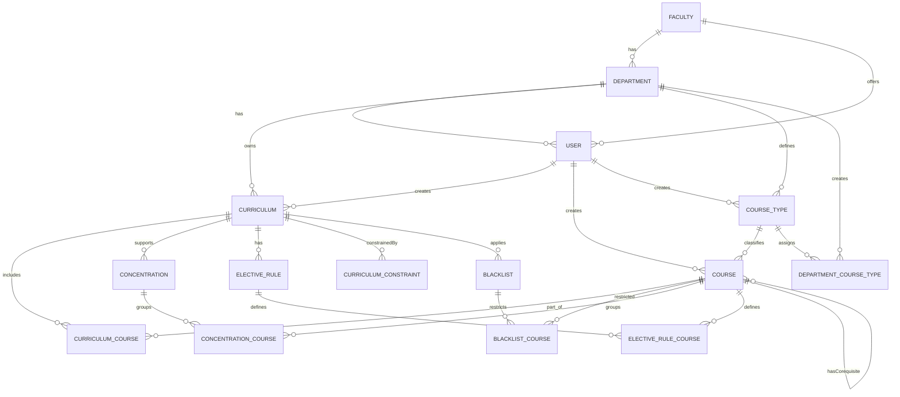

# Corrected ER Diagram - Course Audit System

## Mermaid.live Code

Copy and paste this code into [mermaid.live](https://mermaid.live) to generate the diagram.



---

## Key Changes from Original Diagram

### ✅ **Added (Missing Junction Tables):**
1. **CURRICULUM_COURSE** - Junction between CURRICULUM and COURSE
2. **BLACKLIST_COURSE** - Junction between BLACKLIST and COURSE  
3. **CONCENTRATION_COURSE** - Junction between CONCENTRATION and COURSE
4. **ELECTIVE_RULE_COURSE** - Junction between ELECTIVE_RULE and COURSE

### ✅ **Kept (As Requested):**
- **FACULTY → USER** relationship (offers) maintained

### ✅ **Removed:**
- ~~USER → DEPARTMENT_COURSE_TYPE~~ (incorrect relationship - this junction has no createdById)

### ✅ **Enhanced:**
- All entities now show key attributes
- Junction tables properly displayed
- Self-referencing COURSE relationships (prerequisites/corequisites) shown
- Proper cardinality notation (||--o{) for one-to-many relationships

---

## Entity Count: 15 Total

**Core Entities (7):**
- FACULTY, DEPARTMENT, USER, CURRICULUM, COURSE, COURSE_TYPE, CONCENTRATION

**Rule/Constraint Entities (3):**
- ELECTIVE_RULE, BLACKLIST, CURRICULUM_CONSTRAINT

**Junction Tables (5):**
- CURRICULUM_COURSE, DEPARTMENT_COURSE_TYPE, CONCENTRATION_COURSE, ELECTIVE_RULE_COURSE, BLACKLIST_COURSE

---

## How to Use

1. Copy the entire mermaid code block (between the ```mermaid tags)
2. Go to [mermaid.live](https://mermaid.live)
3. Paste the code in the editor
4. Export as PNG, SVG, or PDF

---

## Alignment with schema.prisma

✅ **Fully Aligned** - This diagram accurately represents the current database schema (excluding AuditLog and StudentCourse per requirements)

**Generated:** October 14, 2025  
**Status:** Production-Ready for Presentation
